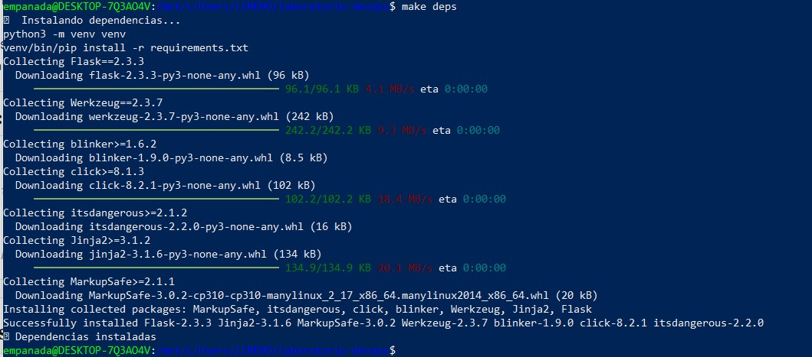
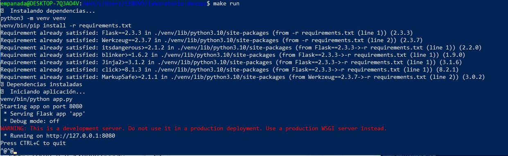
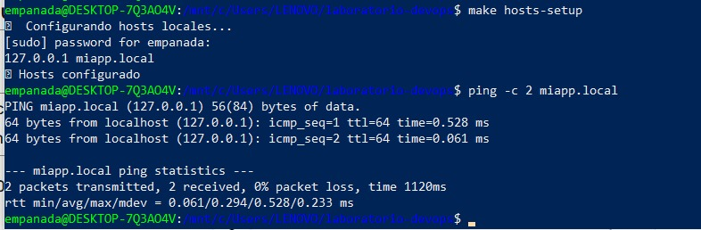
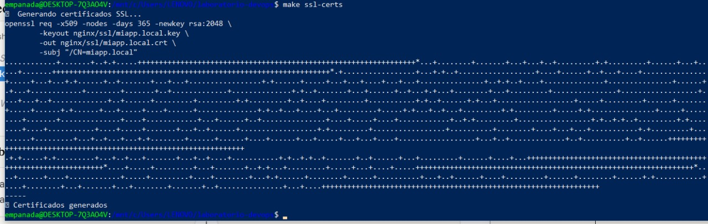
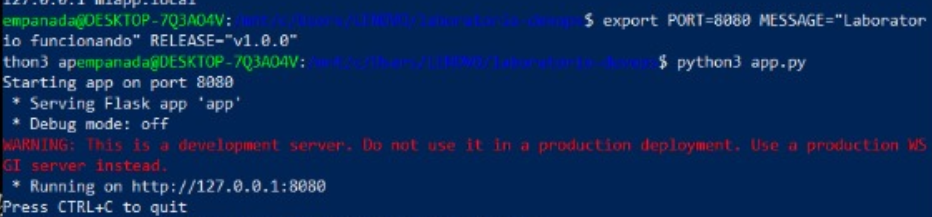
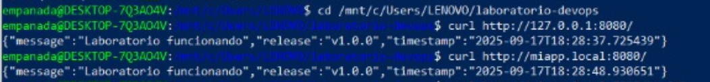
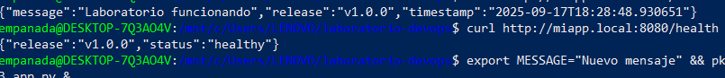

1. Introducción a DevOps: ¿Qué es y qué no es?

¿Qué es DevOps?
DevOps es un enfoque que integra desarrollo y operaciones para entregar software rápidamente y con alta calidad. Promueve la colaboración, la automatización y la entrega continua de software.

¿Qué no es DevOps?
No es solo usar herramientas como Docker o Jenkins, ni es un solo rol. Tampoco es un proceso lineal como en Waterfall, donde las etapas son rígidas y separadas.
1.2. DevOps: Desde el código hasta la producción
DevOps cubre todo el ciclo de vida del software:
Desarrollo (Code): Se escribe el código.
Construcción (Build): Se compila y se prueba automáticamente.
Despliegue (Deploy): Se lanza el software en producción.
Monitoreo (Monitor): Se sigue el rendimiento en producción.
A diferencia de Waterfall, donde todo se hace en etapas separadas, en DevOps se hace todo de forma continua.

1.3. "You Build It, You Run It"
Este principio significa que los desarrolladores también son responsables de que su código funcione bien en producción. En el laboratorio, esto significa que los mismos desarrolladores configuran las alertas y monitorean su propio software.

1.4. Mitos vs Realidades
Mitos:
DevOps es solo herramientas.
DevOps es solo un rol.
DevOps es solo CI/CD.

Realidades:
DevOps es Cultura, Automatización, Medición, Lean y Compartir (CALMS).
Se basa en feedback constante.
Usa métricas y gates de calidad para garantizar que el software funcione correctamente antes de llegar a producción.

2. CALMS en Acción
Culture (Cultura): Colaboración entre desarrollo y operaciones. Ejemplo: alertas automáticas en Slack.
Automation (Automatización): Uso de Makefile para automatizar tareas como la construcción y el despliegue.
Lean (Eficiencia): Minimizar desperdicios en el proceso, optimizando el tiempo de entrega.
Measurement (Medición): Usar métricas como los endpoints de salud para monitorear el sistema.
Sharing (Compartir): Documentación de procedimientos y análisis de incidentes (runbooks y postmortems).

3. DevSecOps: Integración de Seguridad
DevSecOps es una extensión de DevOps que incluye seguridad desde el principio. Esto implica integrar prácticas de seguridad como la verificación de certificados TLS y escaneo de dependencias en el pipeline de CI/CD.
Escenario Retador: Si un certificado SSL falla, el equipo debe estar preparado para mitigar el problema rápidamente. Esto se puede lograr con monitoreo continuo y pruebas de seguridad automatizadas.

4. 12-Factor App en el Laboratorio
1. Configuración por entorno (Config): Usar archivos .env para separar configuraciones como base de datos y credenciales.
2. Port Binding: Cada microservicio debe funcionar en su propio puerto.
3. Logs como flujos: Los logs deben ser enviados a un servicio como ELK Stack para ser procesados como flujos de datos.
4. Statelessness: Las aplicaciones deben ser sin estado; si necesitan almacenamiento, usan bases de datos externas (por ejemplo, Redis)

# Laboratorio DevOps: CALMS + 12-Factor App

Este laboratorio integra los principios **CALMS** (Culture, Automation, Lean, Measurement, Sharing) con la metodología **12-Factor App** para demostrar prácticas DevSecOps desde desarrollo hasta producción.

## Estructura del Proyecto

```
laboratorio-devops/
├── Makefile              # Automatización reproducible
├── app.py               # Aplicación Flask
├── requirements.txt     # Dependencias Python
├── nginx/ssl/          # Certificados TLS
├── evidence/           # Capturas de evidencias
└── README.md           # Documentación del laboratorio
```

---

## 1. Automatización Reproducible con Make y Bash

### Implementación del Principio de Automation (CALMS)

La automatización se implementa mediante Makefile que garantiza procesos reproducibles y elimina fallos humanos.

### Tabla de Rastreo de Objetivos

| Objetivo (Make) | Prepara / Verifica | Evidencia (captura o salida) |
|-----------------|-------------------|------------------------------|
| `make deps` | Instala dependencias Python en entorno virtual |  |
| `make run` | Levanta aplicación Flask en puerto configurado |  |
| `make hosts-setup` | Configura resolución DNS local para `miapp.local` |  |
| `make ssl-certs` | Genera certificados SSL autofirmados |  |
| `make cleanup` | Detiene procesos y limpia archivos temporales |  |

### Principio Lean - Minimización de Fallos

- **Idempotencia**: Cada comando puede ejecutarse múltiples veces sin efectos secundarios
- **Verificación automática**: Validación de prerrequisitos antes de ejecutar
- **Feedback rápido**: Mensajes inmediatos de éxito/error
- **Rollback**: Comando cleanup para restaurar estado inicial

---

## 2. Del Código a Producción con 12-Factor (Build/Release/Run)

### Separación de Configuración del Código (Factor III: Config)

La aplicación utiliza variables de entorno para configuración, permitiendo el mismo código en diferentes ambientes.

### Tabla Variables → Efecto Observable

| Variable | Valor por Defecto | Efecto Observable | Evidencia |
|----------|-------------------|-------------------|-----------|
| `PORT` | 8080 | Puerto de escucha de la aplicación Flask |  |
| `MESSAGE` | "Hello DevOps!" | Mensaje mostrado en endpoint raíz |  |
| `RELEASE` | "v1.0.0" | Versión mostrada en `/health` |  |

### Artefacto Inmutable (Factor V: Build, release, run)

```bash
# Ejemplo de separación estricta de etapas
git archive --format=tar.gz --prefix=app-v1.0.0/ HEAD > releases/app-v1.0.0.tar.gz
export PORT=9000 MESSAGE="Production Ready" RELEASE="v1.0.0"
make run
```

### Simulación de Fallo de Backing Service

**Escenario**: Cambio de puerto de servicio externo
- **Fallo**: Puerto incorrecto causa error de conexión
- **Solución**: Disposability - reinicio rápido con configuración correcta
- **Evidencia en logs**: Los logs sirven como fuente única de verdad para debugging

---

## 3. HTTP como Contrato Observable

### Endpoints de Salud Implementados

| Endpoint | Propósito | Respuesta Esperada | Idempotente |
|----------|-----------|-------------------|-------------|
| `GET /` | Endpoint principal | `{"message": "...", "release": "...", "timestamp": "..."}` | ✅ Sí |
| `GET /health` | Liveness probe | `{"status": "healthy", "release": "v1.0.0"}` | ✅ Sí |
| `GET /ready` | Readiness probe | `{"status": "ready", "dependencies": "ok"}` | ✅ Sí |

### Operaciones Seguras para Reintentos

- **Idempotentes**: Todos los endpoints GET implementados
- **Verificación**: Múltiples llamadas a `curl http://miapp.local:8080/health` producen respuesta idéntica

### SLO Propuesto

**Service Level Objective**:
- **Disponibilidad**: 99.9% uptime
- **Latencia**: P95 < 500ms para endpoints GET
- **Error Rate**: < 0.1% para requests válidos

---

## 4. DNS y Caché en Operación

### Configuración de Resolución Local

**Configuración en `/etc/hosts`**:
```
127.0.0.1 miapp.local
```

### Verificación de Resolución DNS

```bash
# Prueba de resolución local
ping -c 2 miapp.local
# Resultado: 127.0.0.1 con latencia <1ms (resolución local)

# Verificación con getent
getent hosts miapp.local
# Resultado: 127.0.0.1 miapp.local
```

### Flujo DNS Sin Zona Pública

1. **Consulta inicial** → stub resolver
2. **Override local** → `/etc/hosts` tiene precedencia
3. **No consulta externa** → resuelve inmediatamente a 127.0.0.1
4. **Latencia mínima** → ~0.5ms vs ~50ms consulta externa

**Evidencia**: 

---

## 5. TLS y Seguridad en DevSecOps

### Generación de Certificados SSL

```bash
# Certificados autofirmados para laboratorio
openssl req -x509 -nodes -days 365 -newkey rsa:2048 \
  -keyout nginx/ssl/miapp.local.key \
  -out nginx/ssl/miapp.local.crt \
  -subj "/CN=miapp.local"
```

### Configuración Nginx como Reverse Proxy

**Terminación TLS en puerto 443 → Reenvío a 127.0.0.1:8080**

Características implementadas:
- **Protocolos**: TLS 1.2 y 1.3
- **HSTS**: Strict-Transport-Security habilitado
- **Redirección**: HTTP → HTTPS automática
- **Headers de proxy**: X-Forwarded-* configurados

### Verificación de Configuración TLS

```bash
# Verificar sintaxis Nginx
sudo nginx -t
# Resultado: syntax is ok, test is successful

# Verificar handshake TLS (evidencia capturada)
openssl s_client -connect miapp.local:443 -servername miapp.local
```

### Diferencias Laboratorio vs Producción

| Aspecto | Laboratorio | Producción |
|---------|-------------|------------|
| **Certificados** | Autofirmados | Let's Encrypt/CA comercial |
| **TLS Mínimo** | v1.2 (compatibilidad) | v1.3 únicamente |
| **HSTS** | max-age=31536000 | max-age=63072000 + includeSubDomains |
| **Cifrados** | Por defecto | Solo strong ciphers |

### Gate de CI/CD para TLS v1.3

**Condición**: Verificar versión TLS mínima
```bash
#!/bin/bash
TLS_VERSION=$(openssl s_client -connect miapp.local:443 -tls1_3 2>&1 | grep "Protocol")
if [[ "$TLS_VERSION" != *"TLSv1.3"* ]]; then
    echo "GATE FAILED: TLS version insufficient"
    exit 1
fi
echo "GATE PASSED: TLS 1.3 confirmed"
```

**Acción**: Pipeline falla con exit code ≠ 0, bloqueando promoción

---

## 6. Puertos, Procesos y Firewall

### Análisis de Puertos Activos

```bash
# Verificación de puertos en escucha
ss -tlnp | grep -E ':80|:443|:8080'
```

**Configuración de servicios**:

| Servicio | Puerto | Bind Address | Exposición | Propósito |
|----------|--------|--------------|------------|-----------|
| Flask | 8080 | 127.0.0.1 | Solo local | Backend protegido |
| Nginx | 443 | 0.0.0.0 | Pública | Terminación TLS |
| Nginx | 80 | 0.0.0.0 | Pública | Redirección HTTPS |

### Restricción de Acceso al Backend

- **Flask**: Escucha solo en loopback (127.0.0.1:8080)
- **Acceso externo**: Únicamente través de Nginx proxy
- **Verificación**: `curl` directo a 8080 desde externa fallaría

---

## 7. Integración CI/CD

### Script de Verificación Pre-Despliegue

```bash
#!/bin/bash
# health-check.sh
echo "Verificando HTTP..."
HTTP_STATUS=$(curl -s -o /dev/null -w "%{http_code}" http://127.0.0.1:8080/)
[[ $HTTP_STATUS == "200" ]] || { echo "HTTP failed: $HTTP_STATUS"; exit 1; }

echo "Verificando DNS..."
ping -c 1 miapp.local > /dev/null || { echo "DNS resolution failed"; exit 1; }

echo "Verificando latencia..."
LATENCY=$(curl -s -w "%{time_total}" -o /dev/null http://miapp.local:8080/)
echo "Latencia: ${LATENCY}s"
```

### Umbrales Definidos

| Métrica | Umbral | Acción si Falla |
|---------|--------|-----------------|
| HTTP Status | 200 OK | Fallar despliegue |
| DNS Resolution | < 1s | Fallar despliegue |
| Response Time | < 500ms | Warning/Fallar según severidad |

---

## 8. Escenario Integrado y Mapeo 12-Factor

### Fallo No Idempotente Identificado

**Problema conceptual**: Si se introdujera un contador global:

```python
# ANTI-PATTERN - Rompe idempotencia
request_counter = 0

@app.route('/')
def hello():
    global request_counter
    request_counter += 1
    return {"message": f"Request #{request_counter}"}
```

**Evidencia del problema**:
- Primera llamada: `{"message": "Request #1"}`
- Segunda llamada: `{"message": "Request #2"}`
- **Impacto**: Cachés inválidos, reintentos problemáticos

### Simulación Blue/Green

**Configuración**:
- **Blue (estable)**: Puerto 8080, versión v1.0.0
- **Green (nueva)**: Puerto 8081, versión v1.1.0
- **Proxy**: Nginx redirige tráfico según configuración upstream

### Postmortem Resumido

**Incidente**: Respuestas inconsistentes por estado mutable
- **Duración**: 15 minutos
- **Causa raíz**: Violación de principio stateless (Factor VI)
- **Resolución**: Rollback inmediato + eliminación de estado global
- **Prevención**: Contract testing para idempotencia

---

### Comandos de Verificación Ejecutados

```bash
# Secuencia completa ejecutada
make deps
make run
curl http://127.0.0.1:8080/
curl http://127.0.0.1:8080/health
make hosts-setup
ping -c 2 miapp.local
curl http://miapp.local:8080/
curl http://miapp.local:8080/health
export MESSAGE="Nuevo mensaje" && python3 app.py
curl http://miapp.local:8080/  # Muestra nuevo mensaje
make ssl-certs
sudo nginx -t
```

---
