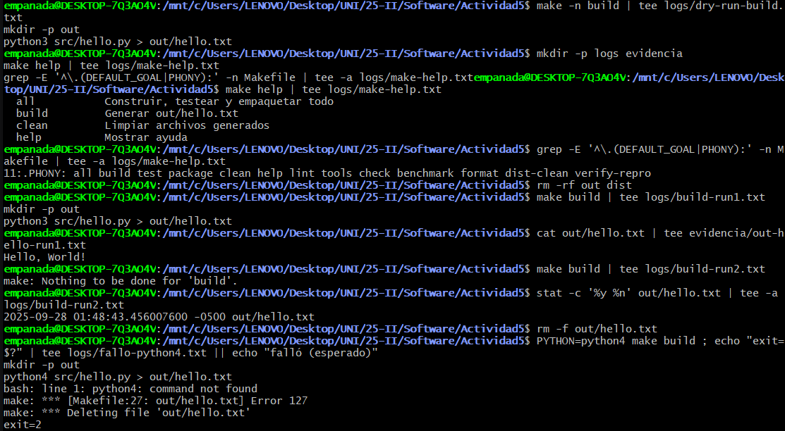
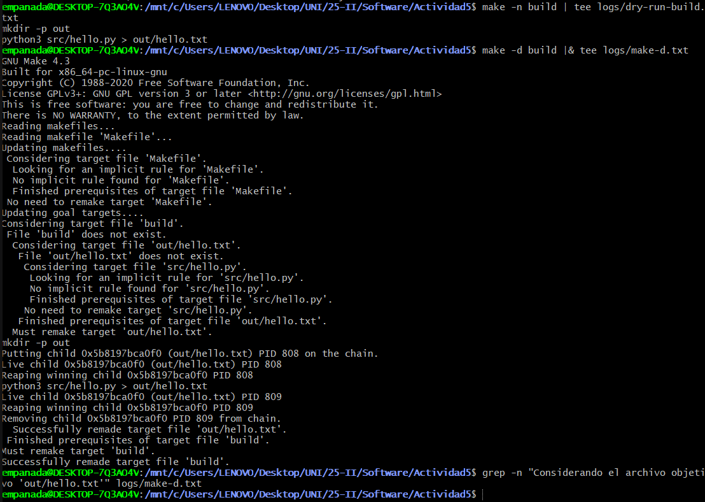
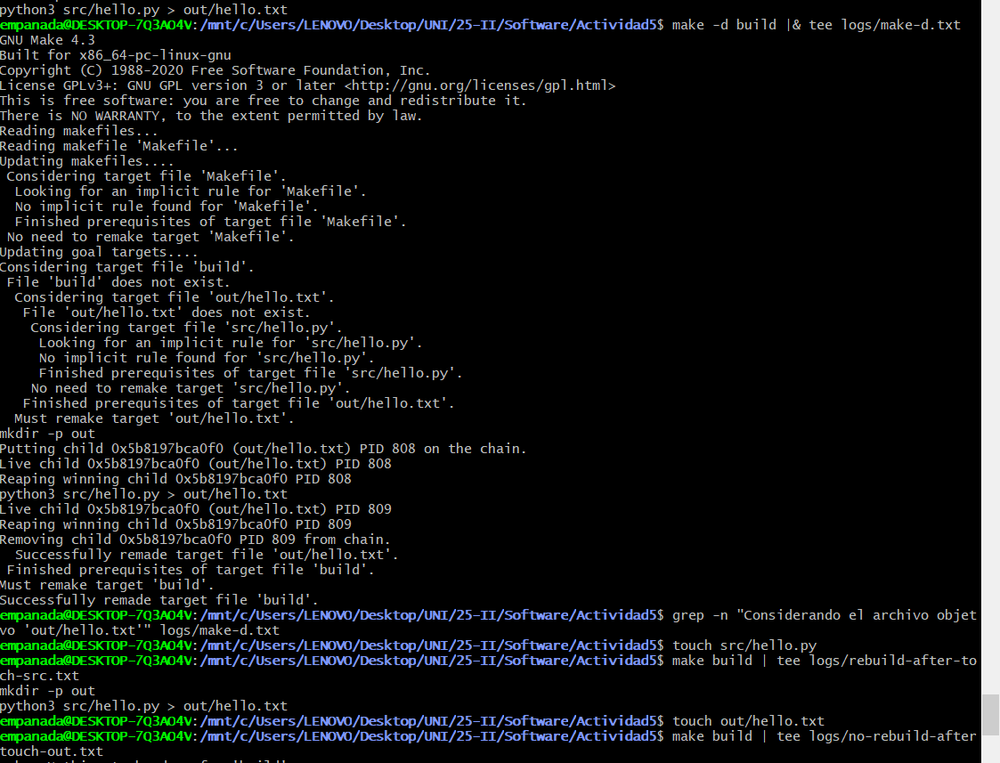
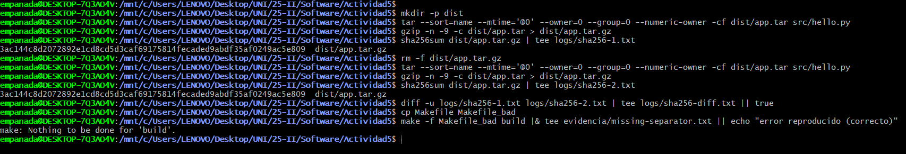

# Actividad 5: Construyendo un pipeline DevOps con Make y Bash
## Capturas de la ejecucion de ejercicios

## Parte 1 - Construir

### ¿Qué hace `build` y cómo funciona `$(PYTHON) $< > $@`?

El objetivo `build` del Makefile genera el archivo `out/hello.txt` a partir del script `src/hello.py`. La regla utiliza **variables automáticas** de Make:

- **`$<`**: Representa el **primer prerequisito** de la regla (en este caso `src/hello.py`)
- **`$@`**: Representa el **target** o archivo objetivo (en este caso `out/hello.txt`)
- **`$(@D)`**: Representa el **directorio** del target (`out/`)

La receta `$(PYTHON) $< > $@` se expande a `python3 src/hello.py > out/hello.txt`, ejecutando el script Python y redirigiendo su salida al archivo de destino. Primero crea el directorio con `mkdir -p $(@D)` para asegurar que existe la ruta de destino.

### Modo estricto y protecciones

El Makefile implementa **modo estricto** mediante:

- **`.SHELLFLAGS := -eu -o pipefail -c`**: 
  - `-e`: Termina inmediatamente si cualquier comando falla
  - `-u`: Error si se usa una variable no definida  
  - `-o pipefail`: Un pipe falla si cualquier comando en la cadena falla
  - `-c`: Ejecuta el comando que sigue

- **`.DELETE_ON_ERROR`**: Si una receta falla, Make automáticamente **elimina el archivo target** para evitar artefactos corruptos o parcialmente generados.

Estas protecciones evitan estados inconsistentes donde un build parcialmente fallido deje archivos corruptos que podrían confundir ejecuciones futuras.

### Idempotencia: Diferencia entre 1.ª y 2.ª corrida de `build`

**Primera ejecución:**
- Make compara timestamps: `src/hello.py` (fuente) vs `out/hello.txt` (target)
- Como `out/hello.txt` no existe, ejecuta la receta completa
- Crea el directorio `out/` y genera `out/hello.txt`
- Salida: `mkdir -p out` y `python3 src/hello.py > out/hello.txt`

**Segunda ejecución:**
- Make compara timestamps nuevamente
- `out/hello.txt` existe y es **más reciente** que `src/hello.py`
- Make concluye que el target está **actualizado**
- **No ejecuta ninguna receta** (idempotencia)
- Salida: `make: 'out/hello.txt' is up to date.`

Esta **incrementalidad** es fundamental en DevOps: solo se reconstruye lo que realmente cambió, ahorrando tiempo en builds grandes y complejos. Make utiliza el **grafo de dependencias** y las **marcas de tiempo** para determinar automáticamente qué trabajo es necesario.

## Parte 2 - Leer

### Observaciones con `make -n` y `make -d`

**`make -n all` (dry-run):**
- Muestra la secuencia de comandos sin ejecutarlos: `tools → lint → build → test → package`
- Las variables automáticas se expanden: `$@` se convierte en `out/hello.txt`, `$<` en `src/hello.py`
- Se observa `mkdir -p out` seguido de `python3 src/hello.py > out/hello.txt`
- El orden respeta las dependencias declaradas en el objetivo `all`

**`make -d build` (debug detallado):**
- Muestra líneas "Considerando el archivo objetivo 'out/hello.txt'" donde Make evalúa si el target necesita reconstruirse
- Compara timestamps entre `src/hello.py` (prerequisito) y `out/hello.txt` (target)
- Si el target no existe o es más antiguo que la fuente, imprime "Debe deshacerse" y ejecuta la receta
- `mkdir -p $(@D)` garantiza que el directorio `out/` existe antes de crear el archivo

### Rol de `.DEFAULT_GOAL`, `.PHONY` y ayuda autodocumentada

- **`.DEFAULT_GOAL := help`**: Hace que `make` sin argumentos ejecute automáticamente `make help`
- **`.PHONY`**: Declara objetivos que no corresponden a archivos reales (`all`, `clean`, `help`, etc.) evitando conflictos con archivos del mismo nombre
- **Ayuda autodocumentada**: `grep -E '^[a-zA-Z0-9_-]+:.*?## '` extrae comentarios `##` del Makefile para generar documentación automática y siempre actualizada

## Parte 3 - Extender

### Detecciones de `shellcheck`/`shfmt`

**`shellcheck` detecta:**
- SC2216: "Piping to 'true', a command that doesn't read stdin" en líneas como `false | true`
- Advertencias sobre quoting inadecuado si se quitan comillas de variables
- Uso correcto de arrays locales con `local -a deps=(...)`

**`shfmt` aplica:**
- Indentación consistente con tabs/espacios
- Espaciado uniforme alrededor de operadores
- Formato estándar para estructuras de control (if/then/fi)

### Demostración de rollback con `trap`

**Funcionamiento del rollback:**
- El `trap 'cleanup $?' EXIT INT TERM` captura la salida del script y señales de interrupción
- Si el test falla (salida != "Hello, World!"), el script:
  1. Mueve `hello.py` a `hello.py.bak` 
  2. Termina con código de salida `2`
  3. El `trap` ejecuta `cleanup()` que restaura el archivo desde `.bak`
  4. Preserva el código de salida original del fallo

**Códigos de salida:**
- `0`: Test exitoso
- `1`: Dependencia faltante
- `2`: Test falló (con rollback automático)
- `3`: Error de archivo temporal perdido

### Reproducibilidad

**Factores que garantizan reproducibilidad:**
- `--sort=name`: Orden alfabético estable de archivos en el tar
- `--mtime='UTC 1970-01-01'`: Timestamp fijo (epoch) para todos los archivos
- `--numeric-owner --owner=0 --group=0`: Usuario/grupo normalizados
- `export TZ=UTC`: Zona horaria fija para operaciones sensibles al tiempo
- `gzip -n`: Evita timestamps en headers de compresión

**Resultado de `verify-repro`:**
Dos ejecuciones consecutivas de empaquetado generan el mismo hash SHA256, confirmando que el build es 100% determinista y reproducible. Esto es crítico para auditoría y verificación de integridad en CI/CD.

## Incidencias y mitigaciones

- **Python no encontrado en Windows**: Solucionado migrando a WSL2 con Ubuntu
- **Herramientas faltantes**: `shellcheck` y `shfmt` instalados vía `apt`
- **Advertencias SC2216**: Mantenidas intencionalmente para demostrar comportamiento de `pipefail`
- **Permisos de ejecución**: `chmod +x scripts/run_tests.sh` aplicado correctamente

## Conclusión operativa

Este pipeline es apto para CI/CD porque implementa **builds deterministas**, **verificación temprana de dependencias**, **limpieza automática en fallos** y **incrementalidad basada en timestamps**. La combinación de modo estricto en Bash, empaquetado reproducible y rollback automático garantiza robustez y confiabilidad en entornos de producción automatizados.
