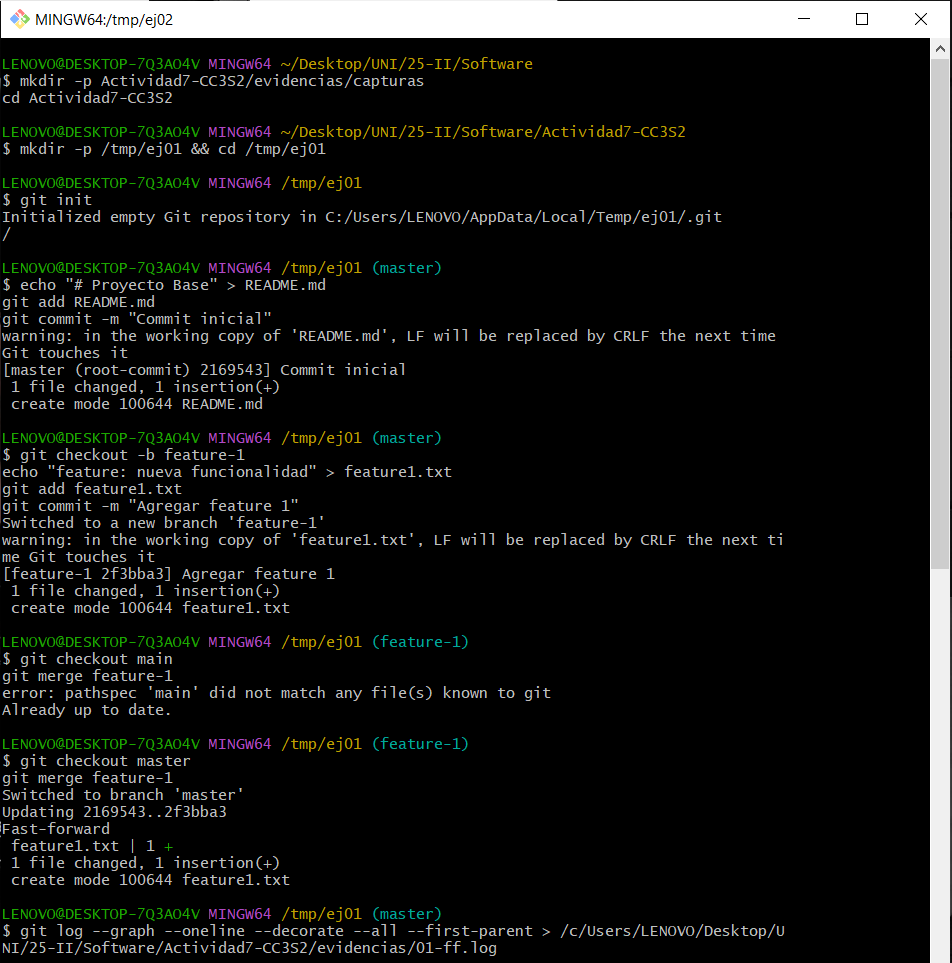
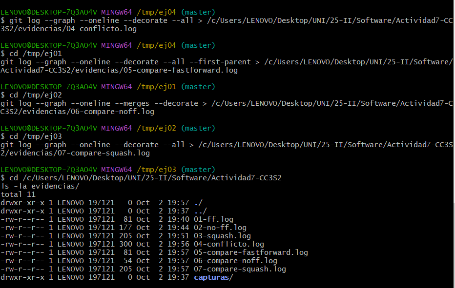

# Actividad 7: Explorando estrategias de fusión en Git

## Evidencias y Resultados

### Estrategias Base de Fusión

#### 1. Fusión Fast-forward (`git merge --ff`)

**¿Cuándo evitarías `--ff` en un equipo y por qué?**
Evitaría `--ff` cuando se trabaja en equipo para mantener la trazabilidad de las integraciones. Los merge commits proporcionan un punto claro de integración y facilitan la identificación de cuándo se fusionaron las características. En equipos colaborativos, `--no-ff` es preferible porque preserva el contexto completo del desarrollo.

#### 2. Fusión No-fast-forward (`git merge --no-ff`)

**Ventajas de trazabilidad:**
- Preserva el historial completo de desarrollo de cada rama
- Muestra claramente cuándo se integraron las características
- Facilita el revert de integraciones completas
- Proporciona puntos de referencia para debugging

**Problemas con exceso de merges:**
- Historial más complejo y difícil de seguir
- Puede generar "contaminación visual" en el grafo
- Dificulta la identificación de la línea principal de desarrollo
- Aumenta el ruido en el log

#### 3. Fusión Squash (`git merge --squash`)

**¿Cuándo conviene?**
- Cuando hay muchos commits intermedios de desarrollo ("WIP", fixes temporales)
- Para mantener limpia la rama principal con commits significativos
- En features que tienen commits de "Work in Progress"
- Cuando el detalle intermedio no es relevante para el historial principal

**¿Qué se pierde respecto a merges estándar?**
- Se pierde el historial detallado de desarrollo
- No se preserva la información de cuándo se hicieron commits específicos
- Dificulta el debugging histórico de la feature
- Elimina la relación entre la rama de feature y main

### 4. Resolución de Conflictos

**Pasos para resolver conflictos:**
1. Identificar los archivos en conflicto con `git status`
2. Abrir el archivo y eliminar los marcadores de conflicto (`<<<<<<<`, `=======`, `>>>>>>>`)
3. Integrar manualmente los cambios de ambas versiones
4. Verificar que la integración es coherente
5. Hacer `git add` y `git commit` para completar el merge

**Prácticas para evitar conflictos:**
- PRs pequeñas y frecuentes
- Comunicación constante entre desarrolladores
- Convenciones de código claras
- Ejecución de tests antes del merge
- Actualización frecuente con la rama base

### Comparativas de Historiales

**Análisis del DAG en cada caso:**
- **Fast-forward**: Historial lineal y limpio, ideal para desarrollo secuencial
- **No-fast-forward**: Merge commits que muestran puntos de integración, perfecto para trabajo en equipo
- **Squash**: Commits individuales sin relación directa con la rama de origen, útil para limpieza

**Preferencias por escenario:**
- **Trabajo individual**: Fast-forward por simplicidad
- **Equipo grande**: No-fast-forward para mejor trazabilidad y auditoría
- **Repos con auditoría estricta**: No-fast-forward con signed commits
- **Proyectos con CI/CD**: Combinación según el flujo establecido

### 8. Revertir una Fusión

**¿Cuándo usar `git revert` vs `git reset`?**
`git revert` cuando el historial ya está compartido/publicado, ya que crea un nuevo commit que deshace los cambios sin reescribir historial. `git reset` solo es seguro en repositorios locales no compartidos.

**Impacto en repositorio compartido:**
`git revert` es seguro porque no modifica historial existente, mientras que `git reset` puede causar problemas de sincronización en repos compartidos y requiere force push.

### Variantes DevOps/DevSecOps

#### 9. Fast-Forward Only

Estrategia conservadora que garantiza historial lineal. Falla si no es posible FF, forzando a rebase.

#### 10. Rebase + Fast-Forward

Combina la limpieza del rebase con la simplicidad del FF. Ideal para mantener historial lineal.

#### 11. Pre-commit Validation

Permite ejecutar validaciones (linters, tests, escáneres) antes de confirmar el merge, crucial para DevSecOps.

#### 12. Octopus Merge

Integra múltiples ramas simultáneamente. Útil para features independientes que no conflictúan.

#### 13. Subtree Merge

Para integrar repositorios externos manteniendo su historial. Ideal para vendorización de dependencias.

#### 14. Estrategias de Resolución X

Utilicé `-X ours` para preferir nuestra versión en conflictos, útil en integraciones donde la versión principal tiene prioridad.

#### 15. Merge Firmado

Proporciona trazabilidad criptográfica para auditorías y cumplimiento en entornos regulados.

## Conclusiones

Cada estrategia de merge tiene su lugar en el desarrollo de software:
- **Fast-forward**: Simplicidad y limpieza
- **No-fast-forward**: Trazabilidad y contexto
- **Squash**: Historial condensado y significativo
- **Variantes especializadas**: Para necesidades específicas de DevOps

La elección depende del contexto del proyecto, tamaño del equipo, requisitos de auditoría y flujo de trabajo establecido.
